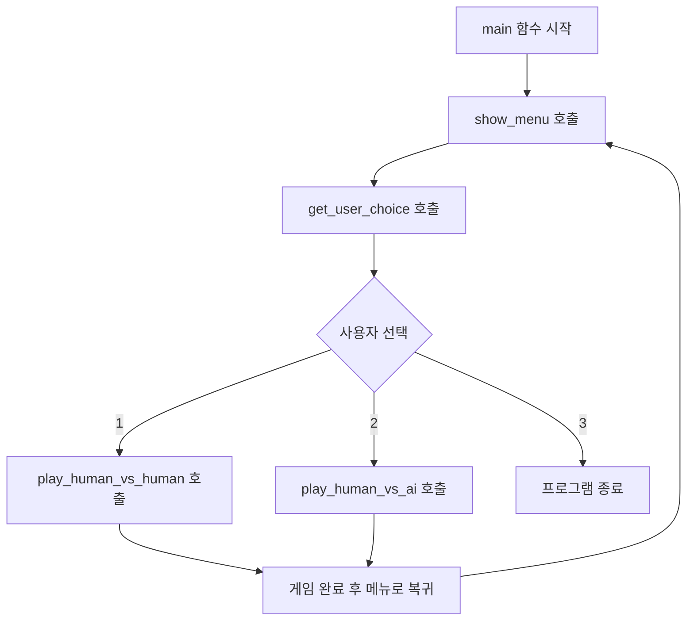
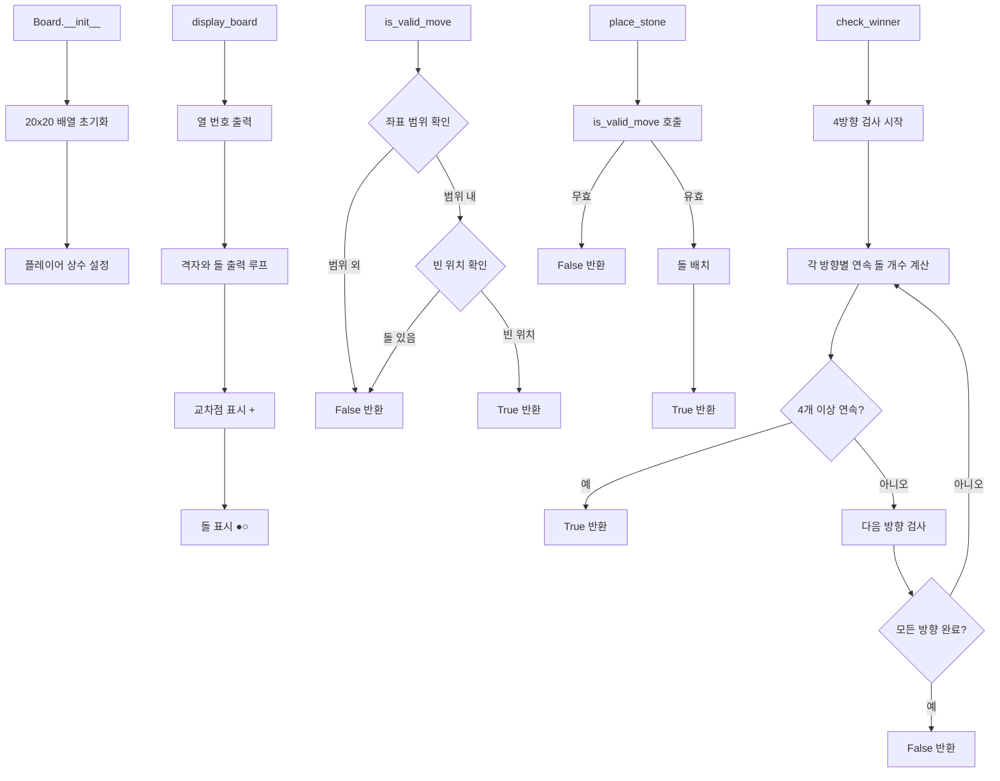
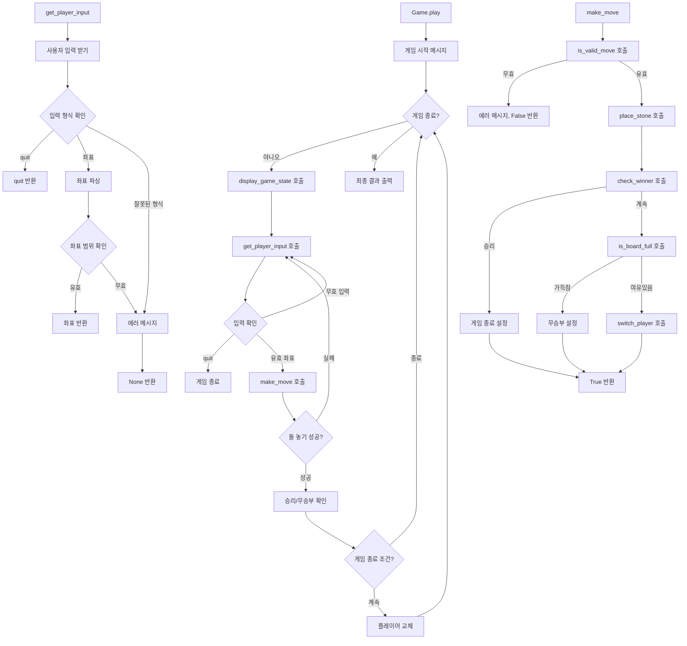
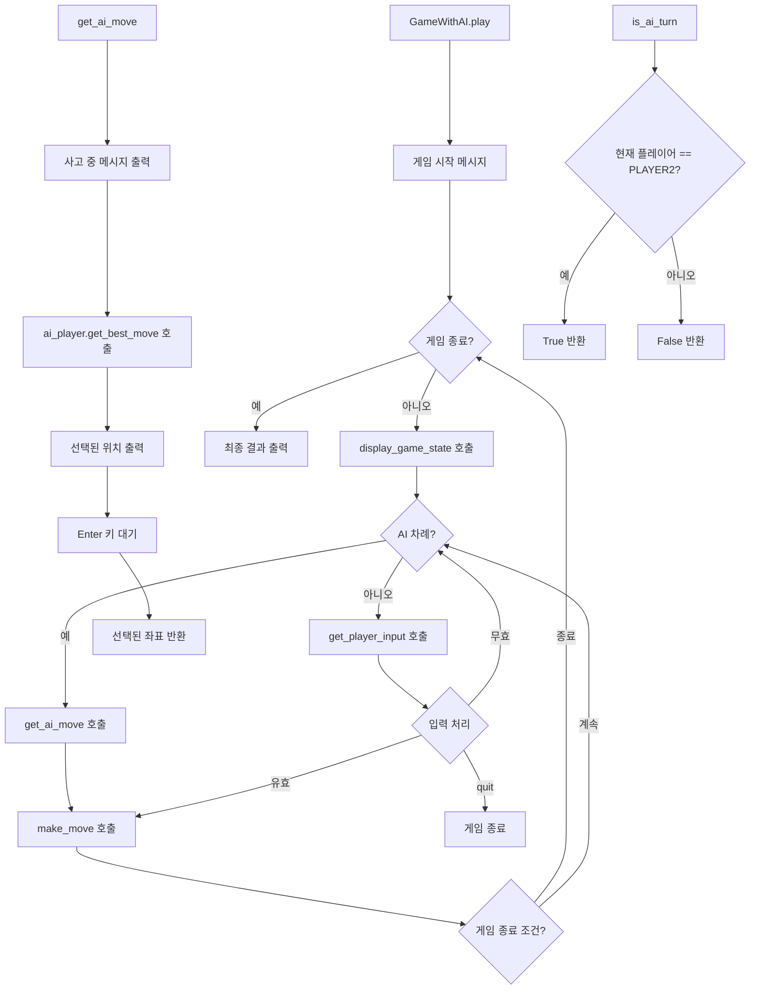
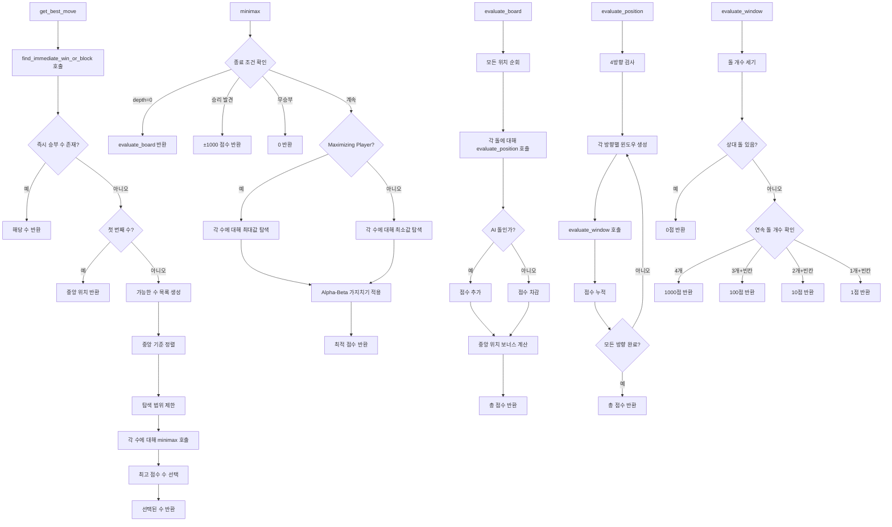
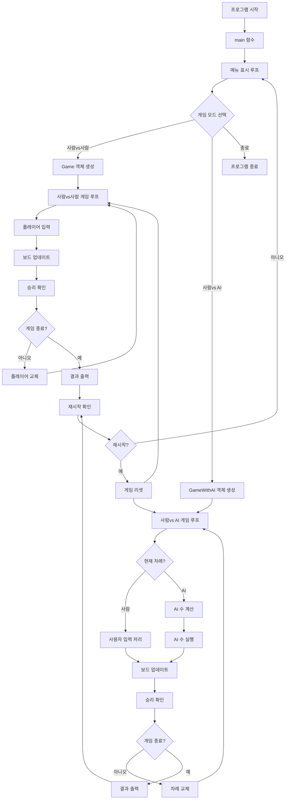

# 4목 게임 (Connect Four)

20x20 바둑판에서 진행하는 4목 게임입니다. 사람끼리 플레이하거나 컴퓨터와 대전할 수 있습니다.

## 기능

1. **사람 vs 사람 모드**: 두 플레이어가 번갈아 가며 플레이
2. **사람 vs 컴퓨터 모드**: AI와 대전 (3단계 난이도)
3. **20x20 바둑판**: 넓은 바둑판에서 전략적 플레이
4. **승리 조건**: 가로, 세로, 대각선으로 4개 연속 배치

## 파일 구조

```
/root/2025_practice/
├── main.py                    # 메인 실행 파일
├── board.py                   # 바둑판 관리 클래스
├── game.py                    # 사람 vs 사람 게임 로직
├── game_with_ai.py           # 사람 vs 컴퓨터 게임 로직
├── ai_player.py              # AI 플레이어 클래스
├── flowchart_human_vs_human.md   # 사람 vs 사람 플로우차트
├── flowchart_human_vs_ai.md      # 사람 vs AI 플로우차트
└── README.md                 # 프로젝트 설명서
```

## 클래스 설계

### Board 클래스 (`board.py`)
- **역할**: 20x20 바둑판 관리
- **주요 메서드**:
  - `__init__(size)`: 바둑판 초기화
  - `display_board()`: 바둑판 출력
  - `is_valid_move(row, col)`: 유효한 움직임 확인
  - `place_stone(row, col, player)`: 돌 놓기
  - `check_winner(row, col, player)`: 승리 조건 확인
  - `is_board_full()`: 무승부 확인

### Game 클래스 (`game.py`)
- **역할**: 사람 vs 사람 게임 진행
- **주요 메서드**:
  - `play()`: 게임 메인 루프
  - `get_player_input()`: 플레이어 입력 처리
  - `make_move(row, col)`: 움직임 실행
  - `display_game_state()`: 게임 상태 출력

### GameWithAI 클래스 (`game_with_ai.py`)
- **역할**: 사람 vs 컴퓨터 게임 진행
- **주요 메서드**:
  - `play()`: AI 게임 메인 루프
  - `get_ai_move()`: AI 움직임 계산
  - `is_ai_turn()`: AI 차례 확인

### AIPlayer 클래스 (`ai_player.py`)
- **역할**: 인공지능 플레이어
- **알고리즘**: 미니맥스 + 알파-베타 가지치기
- **주요 메서드**:
  - `get_best_move(board)`: 최적의 수 계산
  - `minimax()`: 미니맥스 알고리즘
  - `evaluate_board()`: 보드 상태 평가
  - `find_immediate_win_or_block()`: 즉시 승부 확인

## 게임 실행

### 기본 실행
```bash
python3 main.py
```

### 메뉴 옵션
1. **플레이어 vs 플레이어**: 두 사람이 번갈아 플레이
2. **플레이어 vs 컴퓨터**: AI와 대전
   - 쉬움: 탐색 깊이 2
   - 보통: 탐색 깊이 3  
   - 어려움: 탐색 깊이 4
3. **게임 종료**: 프로그램 종료

### 게임 조작
- 돌 놓기: `행 열` 형식으로 입력 (예: `10 15`)
- 게임 종료: `quit` 입력
- 좌표 범위: 0~19

## AI 알고리즘 특징

### 미니맥스 알고리즘
- **목적**: 최적의 수 탐색
- **깊이 제한**: 성능과 품질의 균형
- **알파-베타 가지치기**: 탐색 공간 축소

### 평가 함수
- **4목 완성**: 1000점 (즉시 승리)
- **3목 + 빈칸**: 100점
- **2목 + 빈칸**: 10점
- **1목 + 빈칸**: 1점
- **중앙 위치 보너스**: 전략적 우위

### 최적화 기법
- 중앙 근처부터 우선 탐색
- 탐색 범위 제한 (최대 15-20개 위치)
- 즉시 승리/차단 수 우선 처리
- 보드 복사 최소화

## 플로우차트

### 사람 vs 사람 게임 흐름
자세한 내용은 `flowchart_human_vs_human.md` 참조

### 사람 vs AI 게임 흐름  
자세한 내용은 `flowchart_human_vs_ai.md` 참조

## 함수 단위 플로우차트

### 1. 메인 프로그램 흐름



### 2. Board 클래스 주요 함수



### 3. Game 클래스 주요 함수 (사람 vs 사람)



### 4. GameWithAI 클래스 주요 함수 (사람 vs AI)



### 5. AIPlayer 클래스 주요 함수



### 6. 전체 시스템 통합 플로우



## 게임 규칙

1. **목표**: 가로, 세로, 대각선 중 하나로 4개의 돌을 연속 배치
2. **플레이어**: 흑돌(●)과 백돌(○)
3. **차례**: 흑돌부터 시작하여 번갈아 진행
4. **승리**: 4개 연속 배치한 플레이어 승리
5. **무승부**: 바둑판이 가득 찰 때까지 승부가 나지 않으면 무승부

## 개발 환경

- **언어**: Python 3.13
- **의존성**: 표준 라이브러리만 사용
- **운영체제**: Linux (Debian)

## 실행 예시

```bash
$ python3 main.py

==================================================
          4목 게임 (Connect Four)
==================================================
1. 플레이어 vs 플레이어
2. 플레이어 vs 컴퓨터
3. 게임 종료
==================================================
선택하세요 (1-3): 2

컴퓨터 난이도를 선택하세요:
1. 쉬움 (탐색 깊이: 2)
2. 보통 (탐색 깊이: 3)
3. 어려움 (탐색 깊이: 4)
난이도 선택 (1-3): 2

4목 게임을 시작합니다! (사람 vs 컴퓨터)
...
```

이제 모든 조건을 만족하는 4목 게임이 완성되었습니다!
