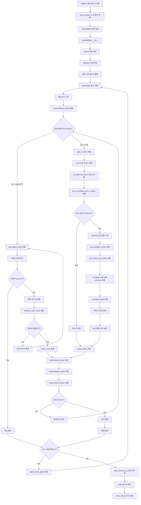
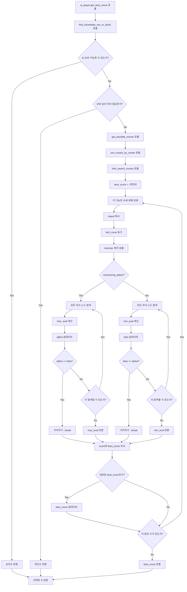
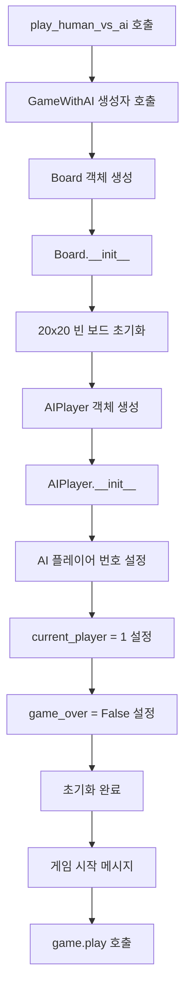
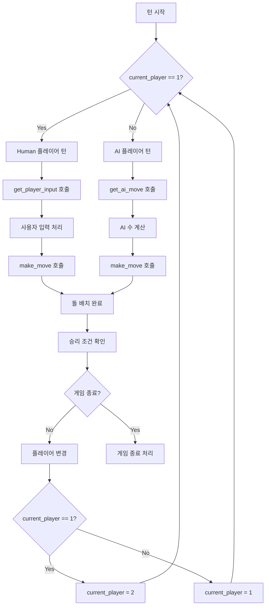

# 4목 게임 플로우차트 (사람 vs 컴퓨터)


## << Mermaid flow chart >>

## 사용자가 메뉴에서 2번 선택 후 Function Flow



## AI 함수 상세 호출 플로우



## 게임 초기화 및 객체 생성 플로우



## 턴 관리 및 플레이어 변경 플로우




## 1. 메인 함수 플로우 

```
main()
├── show_menu() → 메뉴 출력 (3개 옵션)
├── get_user_choice() → 사용자 선택 입력 (1-3)
└── 선택에 따라 분기
    ├── 1: play_human_vs_human() 호출
    ├── 2: play_human_vs_ai() 호출
    └── 3: 프로그램 종료
```

## 2. AI 게임 실행 플로우

```
play_human_vs_ai()
├── AI 난이도 선택
│   ├── 1: 쉬움 (깊이 2)
│   ├── 2: 보통 (깊이 3)
│   └── 3: 어려움 (깊이 4)
├── GameWithAI() 객체 생성 (선택된 난이도로)
├── game.play() 호출
├── 게임 종료 후 재시작 여부 확인
└── 사용자 선택에 따라 분기
    ├── 재시작: game.reset_game() → 반복
    └── 종료: 함수 종료
```

## 3. AI 게임 진행 플로우

```
GameWithAI.play()
├── 게임 시작 메시지 출력
└── 게임 루프 (while not game_over)
    ├── display_game_state() → 현재 게임 상태 출력
    ├── 플레이어 종류에 따라 분기
    │   ├── 사람 플레이어 차례:
    │   │   ├── get_player_input() → 플레이어 입력
    │   │   ├── 'quit' 입력시 → 게임 종료
    │   │   └── 유효한 입력시 → make_move() 호출
    │   └── AI 플레이어 차례:
    │       ├── get_ai_move() → AI 최적 수 계산
    │       └── make_move() 호출
    └── 게임 종료 조건 확인
        ├── 승리 조건 만족 → game_over = True
        ├── 보드 가득참 → game_over = True (무승부)
        └── 계속 진행 → 플레이어 교체
```

## 4. AI 수 계산 플로우

```
AIPlayer.get_best_move(board)
├── find_immediate_win_or_block() → 즉시 승부 확인
│   ├── 즉시 승리 가능한 수 찾기
│   ├── 상대방 승리 차단 수 찾기
│   └── 발견시 즉시 해당 수 반환
├── 첫 번째 수인 경우 → 중앙 위치 반환
├── 가능한 수들을 중앙 기준으로 정렬
├── 탐색 범위 제한 (성능 최적화)
└── 각 가능한 수에 대해:
    ├── 보드 복사본 생성
    ├── 테스트 수 놓기
    ├── minimax() 알고리즘 호출
    └── 최고 점수의 수 선택
```

## 5. 미니맥스 알고리즘 플로우

```
AIPlayer.minimax(board, depth, alpha, beta, maximizing_player)
├── 종료 조건 확인
│   ├── depth == 0 → evaluate_board() 반환
│   ├── 승리 조건 만족 → ±1000 점수 반환
│   └── 무승부 → 0 반환
├── 가능한 수들 중앙 기준 정렬
├── 탐색 범위 제한 (최대 20개)
└── Maximizing/Minimizing에 따라 분기
    ├── Maximizing Player (AI):
    │   ├── 각 가능한 수에 대해 재귀 호출
    │   ├── 최대값 추적
    │   └── Alpha-Beta 가지치기 적용
    └── Minimizing Player (상대방):
        ├── 각 가능한 수에 대해 재귀 호출
        ├── 최소값 추적
        └── Alpha-Beta 가지치기 적용
```

## 6. 보드 평가 함수 플로우

```
AIPlayer.evaluate_board(board)
├── 모든 위치에 대해 반복
├── 각 돌이 있는 위치에서:
│   ├── evaluate_position() 호출
│   ├── AI 돌이면 점수 추가
│   └── 상대 돌이면 점수 차감
├── 중앙 근처 위치에 보너스 점수
└── 총 점수 반환
```

## 7. 위치 평가 함수 플로우

```
AIPlayer.evaluate_position(board, row, col, player, length)
├── 4방향 검사 (가로, 세로, 대각선)
├── 각 방향에 대해:
│   └── length 크기 윈도우들 검사
│       ├── evaluate_window() 호출
│       └── 점수 누적
└── 총 점수 반환
```

## 8. 윈도우 평가 함수 플로우

```
AIPlayer.evaluate_window(window, player)
├── 플레이어 돌, 빈 공간, 상대 돌 개수 세기
├── 상대 돌이 있으면 → 0점 반환
└── 플레이어 돌 개수에 따른 점수
    ├── 4개: 1000점 (승리)
    ├── 3개 + 빈공간 1개: 100점
    ├── 2개 + 빈공간 2개: 10점
    └── 1개 + 빈공간 3개: 1점
```

## 9. AI 클래스 구조

```
AIPlayer 클래스:
├── __init__(player_number, difficulty) → AI 초기화
├── get_best_move(board) → 최적 수 계산 메인 함수
├── find_immediate_win_or_block(board) → 즉시 승부 확인
├── minimax(board, depth, alpha, beta, maximizing) → 미니맥스 알고리즘
├── evaluate_board(board) → 전체 보드 평가
├── evaluate_position(board, row, col, player, length) → 위치별 평가
└── evaluate_window(window, player) → 4칸 윈도우 평가
```

## 10. 전체 AI 게임 시스템 플로우

```
시작
├── main() 함수 실행
├── 사용자 메뉴 선택 (AI 모드 포함)
├── AI 난이도 선택
├── GameWithAI 객체 생성
├── 게임 루프 시작
│   ├── 현재 게임 상태 표시
│   ├── 플레이어 종류 확인
│   ├── 사람 차례: 입력 받기 및 유효성 검사
│   ├── AI 차례: 
│   │   ├── 사고 시간 시각적 표시
│   │   ├── 미니맥스로 최적 수 계산
│   │   └── 선택한 위치 출력
│   ├── 돌 놓기 및 승리 조건 확인
│   ├── 게임 종료 조건 확인
│   └── 플레이어 교체
├── 게임 결과 표시
├── 재시작 여부 확인
└── 프로그램 종료 또는 재시작
```

## 11. AI 성능 최적화 요소

```
성능 최적화:
├── Alpha-Beta 가지치기로 탐색 공간 축소
├── 중앙 근처부터 우선 탐색
├── 탐색 범위 제한 (최대 15-20개 위치)
├── 즉시 승리/차단 수 우선 처리
├── 보드 복사 최소화
└── 깊이 제한으로 계산 시간 조절
```
