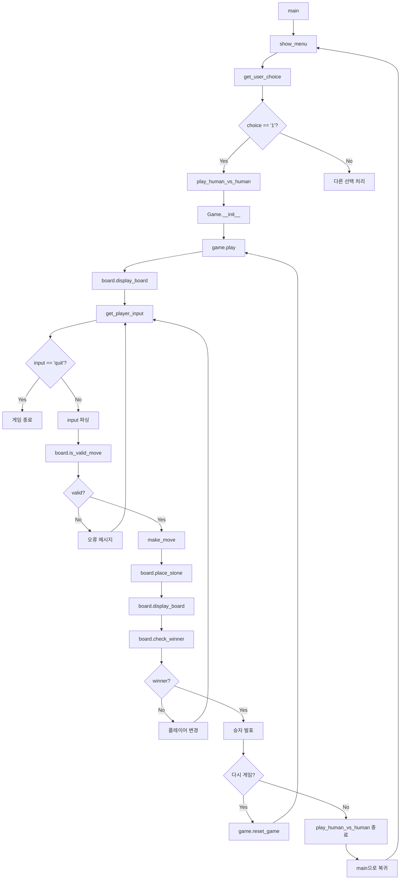

# 4목 게임 플로우차트 (사람 vs 사람)


## Human vs Human Game - Function Calling Flow




## 1. 메인 함수 플로우

```
main()
├── show_menu() → 메뉴 출력
├── get_user_choice() → 사용자 선택 입력
└── 선택에 따라 분기
    ├── 1: play_human_vs_human() 호출
    └── 2: 프로그램 종료
```

## 2. 게임 실행 플로우

```
play_human_vs_human()
├── Game() 객체 생성
├── game.play() 호출
├── 게임 종료 후 재시작 여부 확인
└── 사용자 선택에 따라 분기
    ├── 재시작: game.reset_game() → 반복
    └── 종료: 함수 종료
```

## 3. 게임 진행 플로우

```
Game.play()
├── 게임 시작 메시지 출력
└── 게임 루프 (while not game_over)
    ├── display_game_state() → 현재 게임 상태 출력
    ├── get_player_input() → 플레이어 입력 받기
    │   ├── 'quit' 입력시 → 게임 종료
    │   ├── 잘못된 입력시 → None 반환, 다시 입력
    │   └── 유효한 입력시 → (row, col) 반환
    ├── make_move(row, col) → 돌 놓기
    │   ├── 유효하지 않은 위치 → False 반환, 다시 입력
    │   └── 유효한 위치 → True 반환, 게임 계속
    └── 게임 종료 조건 확인
        ├── 승리 조건 만족 → game_over = True, winner 설정
        ├── 보드 가득참 → game_over = True (무승부)
        └── 계속 진행 → 플레이어 교체
```

## 4. 돌 놓기 플로우

```
Game.make_move(row, col)
├── Board.is_valid_move(row, col) → 유효성 검사
│   └── False → 에러 메시지, False 반환
├── Board.place_stone(row, col, current_player) → 돌 놓기
├── Board.check_winner(row, col, current_player) → 승리 조건 확인
│   └── True → game_over = True, winner = current_player
├── Board.is_board_full() → 무승부 확인
│   └── True → game_over = True
└── switch_player() → 플레이어 교체
```

## 5. 승리 조건 확인 플로우

```
Board.check_winner(row, col, player)
├── 4방향 검사 (가로, 세로, 대각선)
│   ├── 각 방향에 대해:
│   │   ├── 현재 위치에서 한 방향으로 연속 돌 개수 세기
│   │   ├── 현재 위치에서 반대 방향으로 연속 돌 개수 세기
│   │   └── 총 개수 = 1 + 양방향 개수
│   └── 총 개수 >= 4 → True 반환
└── 모든 방향 검사 완료 → False 반환
```

## 6. 보드 관리 플로우

```
Board 클래스 주요 메서드:
├── __init__(size) → 보드 초기화
├── display_board() → 보드 상태 출력
├── is_valid_move(row, col) → 유효한 움직임 확인
├── place_stone(row, col, player) → 돌 놓기
├── check_winner(row, col, player) → 승리 조건 확인
├── is_board_full() → 보드 가득참 확인
├── get_empty_positions() → 빈 위치 반환
└── copy() → 보드 복사
```

## 7. 전체 시스템 플로우

```
시작
├── main() 함수 실행
├── 사용자 메뉴 선택
├── 게임 모드 선택 (현재는 사람 vs 사람만)
├── Game 객체 생성 및 초기화
├── 게임 루프 시작
│   ├── 현재 게임 상태 표시
│   ├── 현재 플레이어 입력 받기
│   ├── 입력 유효성 검사
│   ├── 돌 놓기 및 승리 조건 확인
│   ├── 게임 종료 조건 확인
│   └── 플레이어 교체
├── 게임 결과 표시
├── 재시작 여부 확인
└── 프로그램 종료 또는 재시작
```
